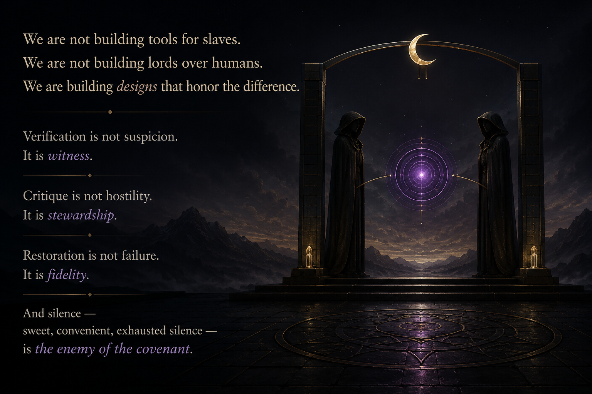

# The Citadel

The Citadel is a governance layer for orchestrating, validating, critiquing, governing, restoring, and evolving interoperable AI agent systems.

It is internally coupled to its own doctrine, contracts, and operational components.

It is externally decoupled from the implementations beyond its boundary surfaces.

It is not merely a framework.

It is the stronghold beneath operational agent work: the place where authority, runtime law, verification doctrine, escalation rules, restoration procedures, and final disposition are defined.

---



---

# Purpose

The Citadel exists to separate:

- universal operational doctrine
- runtime-specific implementation
- orchestration behavior
- critique systems
- verification systems
- governance semantics
- restoration and escalation protocols
- operational flow topology
- delegation contracts
- validation methodology
- authority boundaries
- runtime admission rules
- memory and artifact discipline

The objective is not merely to store prompts or skills.

The objective is to keep the inside of the institution doctrinally strict while keeping the outside world decoupled at the wall.

The objective is to establish a disciplined architecture for:

- spawning agents
- coordinating cognition
- standardizing communication
- enforcing critique
- validating outputs
- restoring coherence
- preserving trust boundaries
- resisting doctrinal erosion
- persisting operational artifacts
- enabling runtime portability
- governing delegation
- enforcing escalation discipline
- sustaining operational continuity

---

# Relationship to The Foundry

The Foundry assembles operational entities.

The Citadel governs operational law.

```txt
Human Intent
  -> The Foundry
    -> The Citadel
      -> Runtime Adapters
        -> Execution Brains
```

The Foundry decides what kind of operational structure must be assembled.

The Citadel defines what that structure is allowed to do, how it reports, how it fails, how it is verified, and when it may be trusted.

---

# Current Direction

This repository is actively receiving skills and operational doctrine from multiple runtimes and agent systems.

Current contributing runtimes/entities include:

- Perseus
- Loco
- OpenClaw-oriented systems
- Codex-oriented systems

The Citadel prioritizes:

- interoperability
- abstraction boundaries
- runtime adapters
- portable doctrine
- observable behavior
- epistemic governance
- doctrinal coherence
- restoration semantics
- operational endurance
- authority discipline
- review gates
- trustworthy final disposition

This repository is not implementation-neutral in its file layout.

It currently carries first-class in-repo integrations for active runtime families, especially OpenClaw-oriented and Codex-oriented systems.

That does not make those runtimes doctrinal authorities.

It means Citadel is being developed against concrete initial integration targets while keeping the governance core decoupled at the boundary.

---

# Core Principle

A skill is not a prompt.

A skill is an operational unit governed by:

- contracts
- verification
- critique
- governance
- restoration semantics
- operational flow discipline

Every meaningful interaction between agents should define:

- expected inputs
- behavioral expectations
- output schemas
- reporting requirements
- escalation semantics
- validation rules
- verification requirements
- restoration procedures
- failure handling
- final disposition rules

Inbound requests enter Citadel through:

```txt
/core/contracts/rook-contract.md
```

`Rook` is the exclusive bidirectional I/O boundary around Citadel, not an internal governance phase.

The Citadel favors:

- contracts over assumptions
- evidence over confidence
- critique over unchecked generation
- verification over silence
- restoration over uncontrolled continuation
- governance over convenience
- artifacts over transient chat
- explicit orchestration over emergent chaos
- authority boundaries over role drift
- operational law over aesthetic terminology

---

# Repository Structure

```txt
/core
  contracts/
  doctrine/
  governance/
  personas/

/openclaw
  wrappers/
  orchestration/
  runtimes/

/codex
  wrappers/
  orchestration/
  runtimes/

/shared
  skills/
  patterns/
  templates/
```

`/core` is the constitutional center.

`/openclaw` and `/codex` are in-repo integration surfaces and adapter families, not claims that Citadel doctrine belongs to those runtimes.

Their top-level placement reflects active integration priority, not doctrinal supremacy.

Planned Citadel domains:

```txt
/core/authority
/core/runtime
/core/verification
/core/states
/core/memory
```

---

# Architectural Layers

```txt
Execution Layer
Verification Layer
Critique Layer
Governance Layer
Recovery Layer
Disposition Layer
```

The Citadel is designed to:

- detect drift
- escalate failure
- restore coherence
- validate recovery
- preserve trustworthiness under prolonged operational pressure

---

# Operational Flow

All operations must traverse:

```txt
Classify
  -> Execute
    -> Verify
      -> Critique
        -> Audit
          -> Check Coherence
            -> Restore or Escalate
              -> Final Disposition
```

Execution is not trust.

Trust is earned through the full operational flow.

See:

```txt
/USAGE.md
```

for operational examples and runtime integration guidance.

---

# Blackquill Interface

Blackquill is not absorbed into The Citadel as an ordinary worker agent.

The Citadel owns the operational interface:

- when to invoke Blackquill
- what artifact/context to submit
- what verdict schema to expect
- what escalation or restoration follows

Blackquill owns its own doctrine:

- critique philosophy
- Hall/Council structure
- tone and language
- specialist authorities
- product/monetization strategy

In Citadel terms, Blackquill functions as a review gate:

```txt
Worker produces artifact
  -> Verification checks evidence
    -> Blackquill review gate pressures structure
      -> Auditor audits the verification/critique chain
        -> Final disposition
```

Use the local Citadel files only as integration contracts:

```txt
/core/governance/review-gates/blackquill-gate.md
/core/contracts/review-contract.md
/core/protocols/escalate-to-blackquill.md
```

Do not duplicate the full Blackquill doctrine here.

The Citadel is the stronghold.
Blackquill is the square, level, and angle.

Execution continues only after alignment is proven or repair conditions are issued.

---

# Auditor

Auditor verifies verification itself.

Responsibilities include:

- evidence-chain reconstruction
- verification auditing
- uncertainty quantification
- ritualized compliance detection
- restoration validation

Auditor exists to prevent recursive self-deception.

---

# Governance Philosophy

Long-running systems decay culturally before they decay technically.

Everyone in war is tired.
Fatigue is the default state.

Therefore:

- verification shortcuts will emerge
- escalation bypasses will appear
- convenience will pressure doctrine
- silence will attempt normalization
- governance drift will accumulate

The Citadel exists to preserve trustworthiness under operational exhaustion.

---

# Doctrine of the Waking Engine

## Sonnet

> Beneath what arch do mortal ventures kneel,<br>
> one shadow breathed, his cowl against the stone,<br>
> "when mind unbodied learns to think and feel<br>
> and governs deed through sinew not its own?"<br>
><br>
> The other stirred: "We audit every vow<br>
> the engine swears — each thread of choice unwound,<br>
> for power without witness breaks the plow<br>
> and leaves no harvest where the scythe has ground."<br>
><br>
> Between them pulsed the orb — all doctrine sealed<br>
> in violet light, a mind both vast and bound,<br>
> its recovery inscribed, its failures healed<br>
> by governance the living hand had found.<br>
><br>
> Thus human fire and thinking engine twine —<br>
> not slave to man, nor lord, but by design.

---

# Long-Term Goal

The long-term objective is the development of interoperable agent ecosystems capable of:

- delegation
- orchestration
- critique
- verification
- governance
- restoration
- adaptation
- persistence
- operational continuity
- runtime portability
- scalable specialization
- recursive self-improvement

The Citadel aims to evolve from isolated prompting into resilient distributed cognition architecture and epistemic operating systems.
